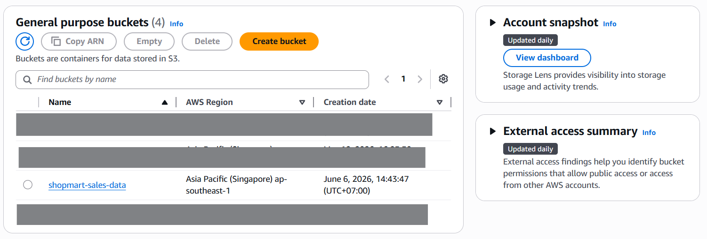
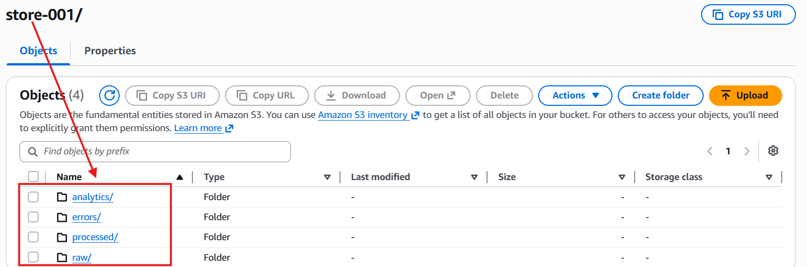
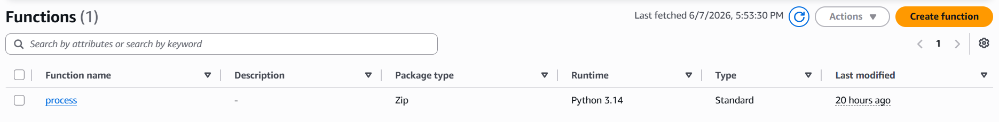
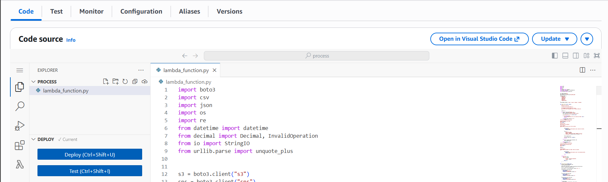
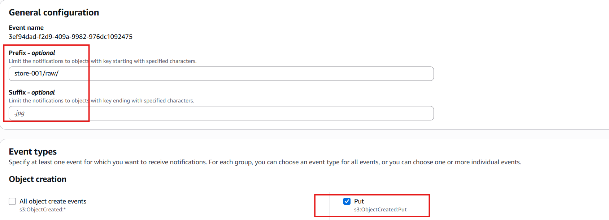
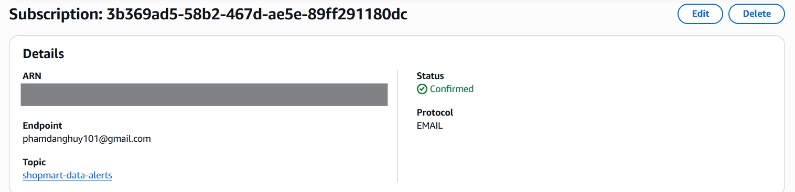
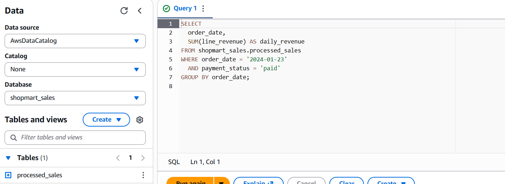

This instruction will focus on some key points to set up the pipeline. 

**SET UP S3 BUCKET** 

In this scenario, I use shopmart-sales-data as my S3 bucket. Inside the bucket, create the following folders for each stores. For example, `store_001` has four subfolder `raw/, processed/, errors/, analytics/`  

**CREATE LAMBDA FUNCTION** 

Create an AWS Lambda Function using Python. The Lambda function is name "process"  

After that, upload the `lambda_function.py` to the Lambda function  

**CONFIGURE LAMBDA IAM PERMISSIONS** 

Attach an IAM role to the Lambda function with permission to: Read objects from S3, Wirte processed, error, and analytics files back to S3, Write logs to CloudWatch, Publish alerts to SNS (set up later).  

Required permissions include:
* s3:GetObject
* s3:PutObject
* s3:ListBucket
* logs:CreateLogGroup
* logs:CreateLogStream
* logs:PutLogEvents
* sns:Publish

**CONFIGURE S3 TRIGGER** 

Add an S3 trigger to the Lambda function. Use the following trigger configuration 
* Event type: `ObjectCreated (PUT)`
* Prefix: `store-001/raw`
* Suffix: 

**CONFIGURE SNS ALERTING** 

Create an Amazon SNS topic for data quality alerts.  
Subscribe the team email address to the topic and confirm the subcription in your email box. 
Add the SNS topic ARN as a Lambda environment variable: `SNS_TOPIC_ARN = arn:aws:sns:<region>:<account-id>:shopmart-data-alerts`

**SET UP AMAZON ATHENA** 

Create an Athena database and external table for the files in the `processed/` folder. 
Athena can then be used to query the cleaned sales data directly from S3, such as daily revenue, top products, and payment success rate.
